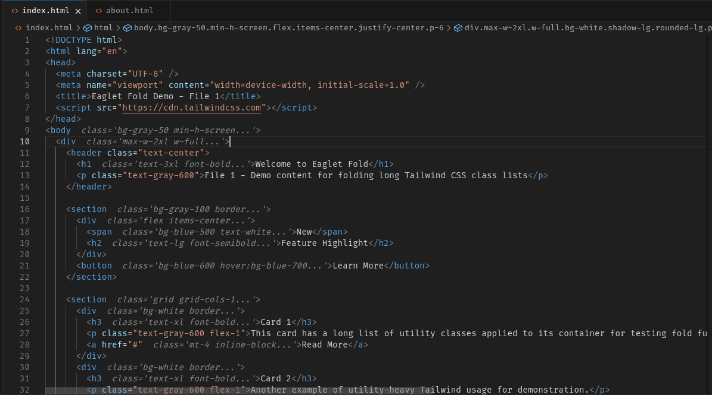
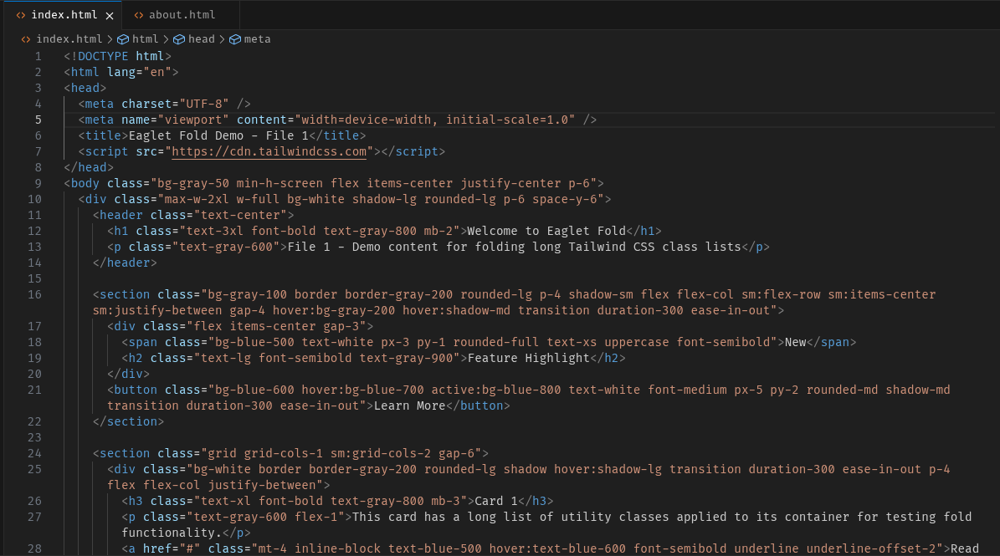
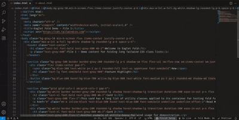

# 🦅 Eaglet Fold

Eaglet Fold is a **VS Code extension** that intelligently folds long [Tailwind CSS](https://tailwindcss.com/) class lists in your HTML (or JSX, TSX, etc.) files.  
It keeps your code **clean, compact, and readable** — while allowing you to unfold and edit classes instantly when needed.

---

## ✨ Features

- **Automatic Folding**  
  Long Tailwind class lists are collapsed into a short preview (e.g., `bg-blue-500 ... text-white`) so your code stays neat.

- **Hover to Expand**  
  Simply hover over the folded classes to preview the full list.

- **Click to Unfold**  
  Expand the folded section with one click and edit directly.

- **Global Fold/Unfold All**  
  Manage folding across the whole file with one command.

- **Per-File Memory** *(optional)*  
  The extension remembers which lines were folded when switching between files.

---

## 📸 Screenshots

### Folding in Action

### Unfolded State

---

## 🎥 Demo Animation

---

## 🚀 Installation

1. Open **VS Code**.
2. Go to the **Extensions** view (`Ctrl+Shift+X` / `Cmd+Shift+X` on Mac).
3. Search for **"Eaglet Fold"**.
4. Click **Install**.

---

## ⚡ Usage

- **Fold Automatically:**  
  When you open a file containing Tailwind class lists, long lists will fold automatically.
  
- **Hover to Preview:**  
  Hover over folded text to see the full list.

- **Unfold:**  
  Click the `(expand)` link in the hover popup or use the command palette.

- **Commands:**
  - `Eaglet Fold: Fold/Unfold All`
  - `Eaglet Fold: Fold/Unfold`
---

## ⚙️ Extension Settings

| Setting | Description | Default |
|---------|-------------|---------|
| `eagletFold.maxPreviewLength` | Number of characters to show in folded preview | `50` |
| `eagletFold.rememberFoldsPerFile` | Remember folding state per file | `true` |
---

## 🛠️ Requirements

- **VS Code** version 1.XX.X or newer  
- Tailwind CSS present in your project for best results

---

## 📜 License

This project is licensed under the **MIT License**.

---

## ❤️ Author

**The Eagle**  
[GitHub Profile](https://github.com/TheEagle-Benson) | [Twitter](https://twitter.com/Ben_codes5002)  

